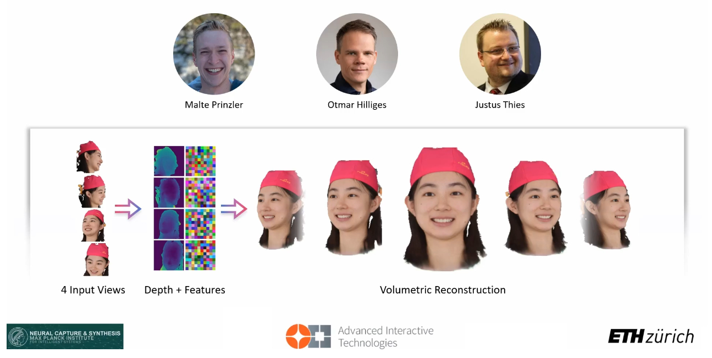

# DINER: Depth-aware Image-based NEural Radiance fields<br><sub>Official PyTorch implementation of the CVPR 2023 paper ([Project Page](https://malteprinzler.github.io/projects/diner/diner.html), [Video](https://www.youtube.com/watch?v=iI_fpjY5k8Y))</sub>

[Malte Prinzler](https://malteprinzler.github.io/), [Otmar Hilliges](https://ait.ethz.ch/), [Justus Thies](https://justusthies.github.io/)<br>

<br><br>



<br><br>

Abstract: <br>
We present Depth-aware Image-based NEural Radiance fields (DINER). Given a sparse set of RGB input views, we predict depth and feature maps to guide the reconstruction of a volumetric scene representation that allows us to render 3D objects under novel views. Specifically, we propose novel techniques to incorporate depth information into feature fusion and efficient scene sampling. In comparison to the previous state of the art, DINER achieves higher synthesis quality and can process
input views with greater disparity. This allows us to capture scenes more completely without changing capturing hardware requirements and ultimately enables larger viewpoint changes during novel view synthesis. We evaluate our method by synthesizing novel views, both for human heads and for general objects, and observe significantly improved qualitative results and increased perceptual metrics compared to the previous state of the art.
<br><br>


<br>
<br>

## Download Code & Install Python Environment
Download the code via
```bash
git clone https://github.com/malteprinzler/diner.git
cd diner
```
DINER was developed and tested with Python3.8, PyTorch 1.11.0, CUDA 11.3. We recommend installing a virtual python environment by running the following commands:

```bash
python3.8 -m venv venv
source venv/bin/activate
pip install torch==1.11.0+cu113 torchvision==0.12.0+cu113 --extra-index-url https://download.pytorch.org/whl/cu113
pip install -r requirements.txt
```

## Downloadable Assets

This repository is accompanied by pretrained model weights and dataset split configurations. Please download the zipped files from [here](https://edmond.mpdl.mpg.de/dataset.xhtml?persistentId=doi:10.17617/3.NBIYQB#) and extract it into the project root. The final directory tree should look like:

```
diner (repository root)
|- assets
|   |- ckpts
|   |- data_splits
| ...
```

## Quickstart: Evaluate Pretrained DINER on DTU

#### 1) Dataset Download

- Download the preprocessed [DTU training data](https://drive.google.com/file/d/1eDjh-_bxKKnEuz5h-HXS7EDJn59clx6V/view) and [Depth_raw](https://drive.google.com/file/d/1eDjh-_bxKKnEuz5h-HXS7EDJn59clx6V/view) from the original [MVSNet repo](https://github.com/YoYo000/MVSNet) and unzip them into `data/DTU`. Use the files from `Depths_raw.zip` to overwrite the files obtained from the dtu_training.rar. The folder structure after unzipping should look like the following:
    ```
    data/DTU (dataset root)
    |- Cameras
    |  |- train
    |  |  |- 00000000_cam.txt
    |  |  |- 00000001_cam.txt
    |  |  |- ...
    |  |  
    |  |- 00000000_cam.txt
    |  |- 00000001_cam.txt
    |  |- ...
    |
    |- Depths
    |  |- scan1
    |  |  |- depth_map_0000.pfm
    |  |  |- depth_map_0001.pfm
    |  |  |- ...
    |  |  |- depth_visual_0000.png
    |  |  |- depth_visual_0001.png
    |  |  |- ...
    |  |  
    |  |- scan1_train
    |  |  |- depth_map_0000.pfm
    |  |  |- depth_map_0001.pfm
    |  |  |- ...
    |  |  |- depth_visual_0000.png
    |  |  |- depth_visual_0001.png
    |  |  |- ...
    |  |
    |  |- scan2
    |  |- scan2_train
    |  |- ...
    |
    |- Depths_preprocessed
    |  |- scan1_train
    |  |  |- depth_map_0000.pfm
    |  |  |- depth_map_0001.pfm
    |  |  |- ...
    |  |  |- depth_visual_0000.png
    |  |  |- depth_visual_0001.png
    |  |- scan2_train
    |  |- ...
    |
    |- Rectified
    |  |- scan1_train
    |  |  |- rect_001_0_r5000.png
    |  |  |- rect_001_1_r5000.png
    |  |  |- rect_001_2_r5000.png
    |  |  |- ...
    |  |- scan2_train
    |  |- ...
    ```<br><br>
- make sure you downloaded the pretrained model weights as described [here](#downloadable-assets)
#### 2) Write Depth Predictions
- run
    ```bash
    bash deps/TransMVSNet/scripts/write_to_dtu.sh
    ```
  this will write the TransMVSNet depth predictions to files like `data/DTU/Depths/scan71/depth_map_0000_TransMVSNet(_conf/_vis).png`. 
- To change the configurations, adapt `deps/TransMVSNet/scripts/write_to_dtu.sh` according to your needs:
    ```bash
    ...
    
    DATA_ROOT="data/DTU/" # path to dtu dataset
    OUTDEPTHNAME="TransMVSNet"  # prefix of the output depth files
    LOG_DIR="outputs/dtu/TransMVSNet_writing"
    CKPT="assets/ckpts/dtu/TransMVSNet.ckpt"  # path to pretrained checkpoint
    NGPUS=1
    BATCH_SIZE=1
    
    ...
    ```
 <br><br>

#### 2) Evaluate Pretrained DINER on DTU
- run
    ```bash
    python python_scripts/create_prediction_folder.py --config configs/evaluate_diner_on_dtu.yaml --ckpt assets/ckpts/dtu/DINER.ckpt --out outputs/dtu/diner_full_evaluation
    ```
  The outputs will be stored in `outputs/dtu/DINER_full_evaluation` by default. Since evaluating DINER on the entire DTU validation set might take quite long, you can set the argument `--n [NUMBER_OF_SAMPLES]` to evaluate DINER only on a subset of the validation set.  

- To change the configurations, adapt `configs/evaluate_diner_on_dtu.yaml` according to your needs.
<br><br>

----------------------------------------------------------------------------------------------------------

## Evaluate DINER on Facescape

#### 1) Download & Preprocess the Facescape Dataset

- Request access for the Facescape dataset via https://facescape.nju.edu.cn/Page_Download/ <br><br>
- Download the Multi-view data (images, camera parameters, and reconstructed 3D shapes) <br><br>
- Extract the downloaded files all into `data/FACESCAPE_RAW`. After extraction, the directory structure should look like this:
    ```
    - data/FACESCAPE_RAW (dataset root)
    |- 1
    |  |- 1_neutral
    |  |  |- 0.jpg
    |  |  |- 1.jpg
    |  |  |- ...
    |  |  |- 54.jpg
    |  |  |- params.json
    |  |- 1_neutral.ply
    |  |- 2_smile
    |  |- 2_smile.ply
    |  |- ...
    |  |- dpmap
    |  |  |- 1_neutral.png
    |  |  |- 2_smile.png
    |  |  |- ...
    |  |  |- ...
    |  |- models_reg
    |  |  |- 1_neutral.obj
    |  |  |- 1_neutral.jpg
    |  |  |- 1_neutral.mtl
    |  |  |- 2_smile.obj
    |  |  |- 2_smile.jpg
    |  |  |- 2_smile.mtl
    |  |  |- ...
    |- 2
    |- ...
    ```
  <br><br>
- Run the automated preprocessing pipeline which will perform cropping, resizing, and color-calibration, via
    ```bash
    ROOT_IN="data/FACESCAPE_RAW"
    ROOT_OUT="data/FACESCAPE_PROCESSED"
    for i in {1..359}
    do 
      out_i=$(printf "%03d" $i)
      python deps/facescape_preprocessing/process_dataset.py --dir_in $ROOT_IN/$i --dir_out $ROOT_OUT/$out_i
    done
    ```
  Note that while it is possible to perform the data preprocessing sequentially as outlined above, it is highly advised to parallelize the process. Please refer to `deps/facescape_preprocessing/process_dataset.sh` and `deps/facescape_preprocessing/process_dataset.sub` for an exemplary implementation.

#### 2) Writing TransMVSNet Depth Predictions to Facescape

- make sure that you downloaded the pretrained TransMVSNet weights and unpacked them into the `assets` folder (see instructions [here](#downloadable-assets)).<br><br>
- run
    ```bash
    bash deps/TransMVSNet/scripts/write_to_facescape.sh
    ```
  this will write the TransMVSNet depth predictions to files like `data/FACESCAPE_PROCESSED/033/01/view_00020/depth_TransMVSNet(_vis/_conf).png`.
- To change the configurations, adapt `deps/TransMVSNet/scripts/write_to_facescape.sh` according to your needs.


#### 3) Evaluate Pretrained DINER on Facescape

- run
    ```bash
    python python_scripts/create_prediction_folder.py --config configs/evaluate_diner_on_facescape.yaml --ckpt assets/ckpts/facescape/DINER.ckpt --out outputs/facescape/diner_full_evaluation
    ```
  The outputs will be stored in `outputs/facescape/diner_full_evaluation` by default.
- you can adapt the config file `configs/evaluate_diner_on_facescape.yaml` according to your needs.

----------------------------------------------------------------------------------------------------------

## Evaluate DINER (trained on Facescape) on MultiFace

#### 1) Downloading & Preprocessing the MULTIFACE Dataset

- For downloading of the MULTIFACE dataset, run
  ```bash
  python deps/multiface/download_dataset.py
  ```
  this will automatically download a subset of the MULTIFACE dataset as specified in `configs/download_multiface.json` and store it in `data/MULTIFACE`. It may take a while.
- Run the preprocessing script which will render fg masks and gt depth maps
    ```bash
    python deps/multiface/process_dataset.py --root data/MULTIFACE
    ```

#### 2) Writing TransMVSNet Depth Predictions to MULTIFACE

- make sure that you downloaded the pretrained TransMVSNet weights and unpacked them into the `assets` folder (see instructions [here](#downloadable-assets)).<br><br>
- run
    ```bash
    bash deps/TransMVSNet/scripts/write_to_multiface.sh
    ```
  this will write the TransMVSNet depth predictions to files like `data/MULTIFACE/m--20190529--1004--5067077--GHS/depths/SEN_approach_your_interview_with_statuesque_composure/400349/046029_TransMVSNet(_conf/_vis).png`.
- To change the configurations, adapt `deps/TransMVSNet/scripts/write_to_multiface.sh` according to your needs.


#### 3) Evaluate Pretrained DINER (trained on Facescape) on MULTIFACE

- run
    ```bash
    python python_scripts/create_prediction_folder.py --config configs/evaluate_diner_on_multiface.yaml --ckpt assets/ckpts/facescape/DINER.ckpt --out outputs/multiface/diner_full_evaluation
    ```
  The outputs will be stored in `outputs/facescape/diner_full_evaluation` by default.

----------------------------------------------------------------------------------------------------------

## Train TransMVSNet (Depth Estimator) from scratch

To train the depth estimator from scratch, run

```bash
deps/TransMVSNet/scripts/train_TransMVSNet_dtu.sh  # Training on DTU
```

or

```bash
deps/TransMVSNet/scripts/train_TransMVSNet_facescape.sh  # Training on Facescape
```

.
To change the training settting, please adjust the respective `*.sh` files. Note that the authors of TransMVSNet recommend training with 8 GPUs.

----------------------------------------------------------------------------------------------------------

## Train DINER from scratch

To train DINER from scratch, run 

```bash
python python_scripts/train.py configs/train_dtu.yaml  # Training on DTU
```

or

```bash
python python_scripts/train.py configs/train_facescape.yaml  # Training on Facescape
```
. Note that we use one NVIDIA A100-SXM4-80GB for training.

----------------------------------------------------------------------------------------------------------

## License

The code is available for non-commercial scientific research purposes under the [CC BY-NC 3.0 license](https://creativecommons.org/licenses/by-nc/3.0/legalcode).

## Citation

**If you find our work useful, please include the following citation:**

```
@inproceedings{prinzler2023diner,
  title={DINER: (D)epth-aware (I)mage-based (Ne)ural (R)adiance Fields},
  author={Prinzler, Malte and Hilliges, Otmar and Thies, Justus},    
  booktitle = {Computer Vision and Pattern Recognition (CVPR)},
  year = {2023}
}
```

Parts of our code are heavily inspired by https://github.com/sxyu/pixel-nerf and https://github.com/megvii-research/TransMVSNet so please consider citing their work as well.

## Acknowledgements

Malte Prinzler was supported by the [Max Planck ETH Center for Learning Systems (CLS)](https://learning-systems.org/) during this project. 
